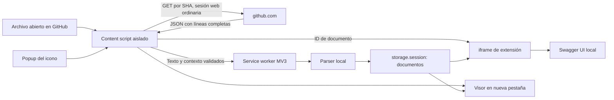

# Arquitectura del MVP 0.2.0

## Responsabilidades

- `src/content.js`: obtiene contexto del JSON/permalink, valida su relación con la URL y lee la página completa. Añade controles al reconocer un contrato y oculta/restaura el código sin reescribirlo. Nunca usa filas visibles o textarea como fuente del contrato.
- `src/github.js`: valida repositorio, ruta, rama/tag y SHA. GET solo a la página del archivo en github.com, por SHA cuando se conoce. Timeout, rechazo de redirecciones y límite incremental de HTML. Lee `codeViewBlobLayoutRoute.StyledBlob.rawLines` o el formato anterior `blob.rawLines`; exige `truncated: false`, comprueba flags, revisión y número de líneas disponible y limita el documento. El HTML se interpreta como texto/JSON, nunca se monta ni ejecuta.
- `src/background.js`: valida origen del mensaje y URL **actual** de pestaña (`sender.url` puede retener la primera ruta SPA). Procesa texto y almacena documentos temporales. No hace solicitudes de red ni escrituras en GitHub; no expone storage.session al content script.
- `src/contract.js`: YAML 1.2 con claves únicas y límites de alias o JSON; detección raíz, validación estructural/referencias y rechazo de referencias externas.
- `src/viewer.*`: CSS/JavaScript aislados de GitHub. Swagger UI en `dist/vendor` recibe spec como objeto. CSP global y del visor `connect-src 'none'`, imágenes externas bloqueadas y ejecución/validación remota desactivadas.
- `src/popup.*`: acciones sobre la pestaña activa mediante mensajes; sin configuración de acceso.
- `scripts/build.mjs`: empaqueta dependencias, copia Swagger UI/licencias y genera iconos locales; sin código remoto durante ejecución.
- `scripts/pack.mjs` y `identity.mjs`: firma local con Chrome usando exclusivamente la clave original y valida el ID CRX3 antes de reemplazar el paquete. La clave pública queda en manifest; la privada no se incluye en Git o dist. Empaquetado y permisos de instalación corporativa son independientes.

## Sesión y acceso

Chrome documenta que content scripts hacen solicitudes bajo el origen web de la página. Se usa fetch de github.com a github.com con el comportamiento same-origin ordinario. RepoContract no lee, extrae ni almacena cookies/credenciales, no añade Authorization y no inicia sesión. No convierte la sesión web en otra forma de acceso mediante REST o APIs internas.

REST tiene autenticación propia; no se presupone que acepte el inicio de sesión web. El alcance es la página del archivo abierto. Un error, redirección o contenido incompleto conserva el código y muestra el problema, sin intentar obtener acceso adicional.

La cookie HttpOnly inventada se configura únicamente en el harness de pruebas. Verifica transporte automático de sesión sin agregar APIs de cookies a la extensión. Página privada real, SSO y políticas de organización siguen pendientes.

## Navegación y concurrencia

GitHub puede conservar embeddedData inicial tras navegar por React. Si el contexto no coincide con la URL, se lee la página actual y se obtiene contexto/contenido de la misma respuesta. Si coincide, se lee por SHA y se verifica revisión. El visor enlaza al permalink recuperado. Se admiten ramas con slash y rutas con espacios.

Un contador de generación descarta lecturas al cambiar URL/revisión o reintentar; también se comprueba la URL antes de enviar texto al worker. MutationObserver con debounce, eventos Turbo/PJAX/popstate y comparación de pathname cada 500 ms siguen SPA. La comprobación periódica no descarga datos. Se reconstruyen controles si GitHub sustituye su contenedor, sin duplicarlos. Cambiar archivo restaura Código y retira el visor anterior.

Caché con escrituras/rotación serializadas, ocho documentos y aproximadamente 6 MiB; sobrevive a suspensión del worker durante sesión. Instalación/actualización la limpia. Un visor caducado pide reabrir desde GitHub.

## Fuentes oficiales

Consultadas para esta actualización el 5 de octubre de 2026 UTC:

- [Chrome: red y origen de content scripts](https://developer.chrome.com/docs/extensions/develop/concepts/network-requests).
- [Chrome: content scripts](https://developer.chrome.com/docs/extensions/develop/concepts/content-scripts).
- [Chrome: CSP](https://developer.chrome.com/docs/extensions/reference/manifest/content-security-policy).
- [Chrome: código remoto MV3](https://developer.chrome.com/docs/extensions/develop/migrate/remote-hosted-code).
- [Chrome: storage.session](https://developer.chrome.com/docs/extensions/reference/api/storage).
- [GitHub: autenticación REST](https://docs.github.com/en/rest/authentication/authenticating-to-the-rest-api).
- [Swagger UI: compatibilidad](https://github.com/swagger-api/swagger-ui#compatibility).
- [Swagger UI: configuración](https://swagger.io/docs/open-source-tools/swagger-ui/usage/configuration/).

Swagger UI 5.33.1 fijado en lockfile. Detección deliberadamente limitada a Swagger 2.0 y OpenAPI 3.0/3.1.
