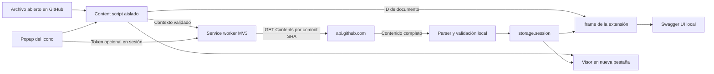

# Arquitectura del MVP

## Responsabilidades

- `src/content.js`: obtiene owner/repo, ruta, rama/tag y commit de los metadatos JSON de GitHub. Admite las estructuras `codeViewLayoutRoute` y `codeViewBlobRoute`, y un permalink como respaldo. Valida que coincidan con la URL. Solo usa el DOM como fuente de contexto y ubicación visual; nunca como fuente del contrato. Añade controles cuando el documento ha sido reconocido y conserva/restaura el contenedor de código sin reescribirlo.
- `src/background.js`: valida el origen del mensaje y la URL **actual** de la pestaña (`sender.url` puede quedar en la ruta inicial de una SPA). Construye una URL de API fija, obtiene el contenido, procesa localmente y guarda una sesión acotada. No acepta una URL arbitraria para fetch ni operaciones de escritura. `storage.session` no se expone al content script.
- `src/github.js`: validación del contexto y transporte GET, con SHA obligatorio, token opcional, timeout, límite incremental de tamaño y errores de acceso/red.
- `src/contract.js`: YAML 1.2 con claves únicas y límites de alias, JSON, detección de marcador raíz, validación estructural y referencias. Las referencias externas se rechazan antes del renderizado.
- `src/viewer.html` / `viewer.js` / `viewer.css`: documento de extensión separado del CSS y JavaScript de GitHub. Swagger UI incluido en `dist/vendor`, spec como objeto, sin URL remota, ejecución ni validación remota. CSP del visor bloquea conexiones e imágenes externas, adicional a la CSP global de la extensión que permite la lectura de la API desde el worker.
- `src/popup.*`: mismas acciones mediante mensajería con la pestaña activa; configuración/eliminación explícita de token.
- `scripts/build.mjs`: esbuild empaqueta dependencias, copia Swagger UI y sus licencias y genera iconos locales deterministas. No usa código remoto durante ejecución.

## Navegación y concurrencia

GitHub puede conservar `embeddedData` de la primera página durante una navegación React. Cuando ese JSON no coincide con la URL actual, el content script hace un GET de la página actual, usando su sesión web, y extrae solo ruta y revisión de sus bloques JSON. No monta ni ejecuta el HTML recuperado. El contrato siempre se descarga después mediante Contents y su autenticación independiente. Esta recuperación tiene límite de tiempo y también participa del contador de generación.

Un contador de generación invalida el resultado de una lectura cuando cambia la URL, revisión o se fuerza Reintentar. Un MutationObserver con debounce detecta cambios de DOM; eventos Turbo/PJAX y popstate aceleran el seguimiento. Una comprobación de pathname cada 500 ms cubre pushState, que no emite un evento estándar. Esta comprobación no descarga datos. Los controles se reconstruyen si GitHub sustituye su contenedor, sin duplicarlos. La selección de vista vuelve a Código al cambiar de archivo y cualquier panel anterior se retira.

La revisión recuperada es el commit que GitHub mostraba en sus metadatos. El GET no usa la rama mutable; por ello el visor en otra pestaña enlaza a un permalink por SHA. Las ramas con slash y las rutas con espacios no se dividen suponiendo que el primer segmento es toda la rama.

La caché de documentos tiene escritura y rotación serializadas, hasta ocho entradas y presupuesto aproximado de 6 MiB. Sobrevive a la suspensión del worker dentro de la sesión de Chrome. No se garantiza conservar pestañas de visor indefinidamente; la caducidad muestra un mensaje para reabrir desde GitHub.

## Decisiones sobre privados

Se usa API Contents con `Accept: application/vnd.github.raw+json` y `ref=<SHA>`. Públicos funcionan sin autorización. Privados requieren token explícito de lectura configurado por el usuario; no se presupone autenticación de la API a partir de cookies. No se lee ni se transfiere el contenido visible de GitHub como sustituto silencioso cuando falla la descarga. Las redirecciones se rechazan para mantener restringido el destino de la solicitud.

## Documentación oficial consultada

Revisada el 4 de octubre de 2026 (America/Lima):

- [Chrome: content scripts y mundos aislados](https://developer.chrome.com/docs/extensions/develop/concepts/content-scripts).
- [Chrome: solicitudes entre orígenes y permisos de host](https://developer.chrome.com/docs/extensions/develop/concepts/network-requests).
- [Chrome: políticas de seguridad de contenido](https://developer.chrome.com/docs/extensions/reference/manifest/content-security-policy).
- [Chrome: código remoto en MV3](https://developer.chrome.com/docs/extensions/develop/migrate/remote-hosted-code).
- [Chrome: storage.session](https://developer.chrome.com/docs/extensions/reference/api/storage).
- [GitHub: Contents, contenido raw, ref y Contents read para fine-grained tokens](https://docs.github.com/en/rest/repos/contents).
- [Swagger UI: compatibilidad oficial](https://github.com/swagger-api/swagger-ui#compatibility).
- [Swagger UI: spec, supportedSubmitMethods, validatorUrl e interceptor](https://swagger.io/docs/open-source-tools/swagger-ui/usage/configuration/).

El paquete npm consultado e instalado fue `swagger-ui-dist@5.33.1`. La tabla de compatibilidad oficial publicada para 5.x incluye Swagger 2.0, OpenAPI 3.0.4 y 3.1.2. RepoContract limita deliberadamente la detección a 2.0/3.0/3.1 aunque el renderizador declare otras versiones.
